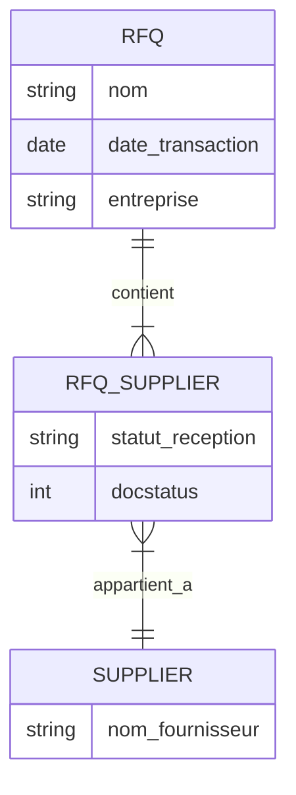
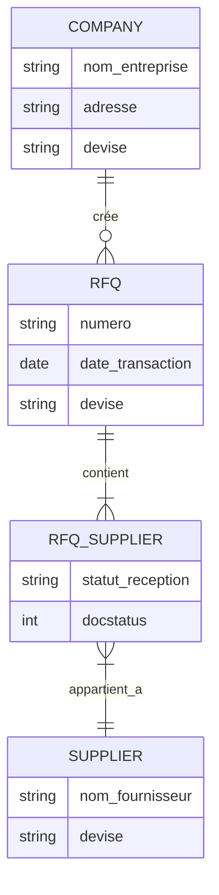

Pour obtenir la liste des demandes de devis envoyées à un fournisseur spécifique dans ERPNext, il faut utiliser deux tables principales : ``tabRequest for Quotation`` et ``tabRequest for Quotation Supplier``. Ces tables sont liées par une relation parent-enfant.

Voici la structure des relations entre les tables :



Dans ce diagramme :

- La ligne `||--|{` indique qu'un devis (RFQ) peut avoir plusieurs entrées de fournisseur (RFQ_SUPPLIER)
- Chaque entrée dans RFQ_SUPPLIER représente un fournisseur auquel le devis a été envoyé
- Le champ `statut_reception` indique si le devis a été reçu du fournisseur
- Le champ `docstatus` permet de filtrer les documents soumis (valeur = 1)

Pour obtenir la liste complète des demandes de devis pour un fournisseur spécifique, voici la requête SQL à utiliser :

```sql
SELECT DISTINCT 
    rfq.name AS numero_devis,
    rfq.transaction_date AS date_devis,
    rfq.company AS entreprise
FROM 
    `tabRequest for Quotation` rfq,
    `tabRequest for Quotation Supplier` rfq_supplier
WHERE 
    rfq.name = rfq_supplier.parent
    AND rfq_supplier.supplier = %(supplier)s
    AND rfq.docstatus = 1
ORDER BY 
    rfq.transaction_date ASC;
```

Cette requête :

1. Utilise une jointure entre les deux tables principales
2. Filtre uniquement les documents soumis (`docstatus = 1`)
3. Retourne les informations essentielles :
          - Le numéro du devis
  - La date de création
  - L'entreprise concernée


Note importante Le paramètre `%(supplier)s` doit être remplacé par l'ID du fournisseur que vous souhaitez consulter.


Dans ERPNext, la différence entre `company` et `supplier` dans une demande de devis (Request for Quotation) est fondamentale pour comprendre le flux de données et la structure du système.

Voici la structure des relations entre ces entités :



Dans ce diagramme :

- La ligne `||--o{` indique qu'une entreprise (Company) peut créer plusieurs demandes de devis (RFQ)
- La ligne `||--|{` montre qu'une demande de devis peut être envoyée à plusieurs fournisseurs (Suppliers)
- La ligne `}|--||` indique qu'une entrée dans RFQ_SUPPLIER appartient à un seul fournisseur

Voici les différences principales entre `company` et `supplier` dans une demande de devis :

###  Company (Entreprise)

- Représente votre organisation qui crée la demande de devis
- Définit les paramètres par défaut :
          - Devise principale de l'entreprise
  - Conditions générales d'achat
  - Informations de facturation


- Apparaît comme l'expéditeur de la demande de devis

###  Supplier (Fournisseur)

- Représente le destinataire de la demande de devis
- Peut avoir ses propres paramètres :
          - Devise spécifique au fournisseur
  - Conditions de paiement particulières
  - Informations de contact spécifiques


- Reçoit et répond à la demande de devis

###  Points Clés à Retenir

1. Une demande de devis (RFQ) est toujours créée par une entreprise (Company)
2. Cette même RFQ peut être envoyée à plusieurs fournisseurs (Suppliers)
3. Chaque fournisseur peut avoir ses propres conditions et devises
4. Les réponses des fournisseurs sont liées à leur propre compte

Cette structure permet une gestion flexible des relations avec les fournisseurs tout en maintenant une cohérence au niveau de l'entreprise.